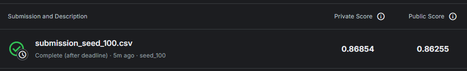
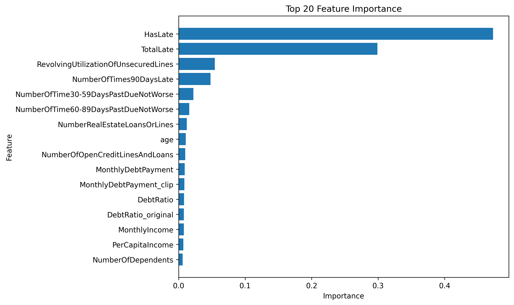

# Kaggle Give Me Some Credit 練習紀錄

本專案是我練習 Kaggle 經典二元分類題目 **Give Me Some Credit** 的機器學習紀錄。

目標是根據客戶的財務與信用資料，預測該客戶在未來兩年內是否會發生嚴重逾期。

競賽目標欄位：

```python
SeriousDlqin2yrs
```

評分指標主要使用：

```python
ROC-AUC
```

---

## 一、專案目標

本專案主要用來練習以下內容：

1. 基礎資料前處理
2. 缺失值處理
3. 隨機森林模型訓練
4. XGBoost 模型訓練
5. 特徵工程
6. Kaggle Public / Private Score 比較
7. 反覆實驗不同特徵對模型分數的影響
8. 使用 Feature Importance 分析模型重視的欄位
9. 使用 5-Fold 交叉驗證提升模型穩定性

---

## 二、資料集簡介

資料來源為 Kaggle 的 **Give Me Some Credit**。

常見欄位包含：

| 欄位名稱                             | 說明                           |
| ------------------------------------ | ------------------------------ |
| SeriousDlqin2yrs                     | 是否在兩年內嚴重逾期，目標欄位 |
| RevolvingUtilizationOfUnsecuredLines | 無擔保循環信用額度使用率       |
| age                                  | 年齡                           |
| NumberOfTime30-59DaysPastDueNotWorse | 30-59 天逾期次數               |
| DebtRatio                            | 負債比率                       |
| MonthlyIncome                        | 月收入                         |
| NumberOfOpenCreditLinesAndLoans      | 信用額度與貸款數量             |
| NumberOfTimes90DaysLate              | 90 天以上逾期次數              |
| NumberRealEstateLoansOrLines         | 房貸或不動產貸款數量           |
| NumberOfTime60-89DaysPastDueNotWorse | 60-89 天逾期次數               |
| NumberOfDependents                   | 家庭扶養人數                   |

---

## 三、使用套件與安裝方式

本專案使用 Python 進行資料處理、模型訓練與結果輸出。

### 主要套件版本

| 套件         |   版本 | 用途                                         | 對應 import                                                |
| ------------ | -----: | -------------------------------------------- | ---------------------------------------------------------- |
| numpy        |  2.3.5 | 建立 OOF 預測陣列、5-Fold 測試集平均預測    | `import numpy as np`                                   |
| pandas       |  2.2.3 | 讀取 CSV、資料整理、建立 submission          | `import pandas as pd`                                    |
| scikit-learn |  1.8.0 | 交叉驗證、缺失值補值、AUC 評估              | `StratifiedKFold`, `SimpleImputer`, `roc_auc_score` |
| xgboost      |  3.1.3 | 建立 XGBoost 二元分類模型                    | `from xgboost import XGBClassifier`                      |
| matplotlib   | 3.10.8 | 繪製圖表，例如 feature importance 或資料分布 | `import matplotlib.pyplot as plt`                        |

安裝方式：

```bash
pip install -r requirements.txt
```

`requirements.txt` 內容：

```txt
numpy==2.3.5
pandas==2.2.3
scikit-learn==1.8.0
xgboost==3.1.3
matplotlib==3.10.8
```

目前主要 import 如下：

```python
import numpy as np
import pandas as pd

from sklearn.model_selection import StratifiedKFold
from sklearn.impute import SimpleImputer
from sklearn.metrics import roc_auc_score

from xgboost import XGBClassifier

import matplotlib.pyplot as plt
```

如果需要確認自己電腦目前的套件版本，可以執行：

```bash
pip freeze
```

或在 Python / Notebook 中執行：

```python
import numpy as np
import pandas as pd
import sklearn
import xgboost
import matplotlib

print("numpy:", np.__version__)
print("pandas:", pd.__version__)
print("scikit-learn:", sklearn.__version__)
print("xgboost:", xgboost.__version__)
print("matplotlib:", matplotlib.__version__)
```

---

## 四、程式流程總覽

本專案目前主要程式流程如下：

1. 讀取 `cs-training.csv` 與 `cs-test.csv`
2. 保留測試集 `Id`，作為最後 submission 使用
3. 移除訓練集中 `NumberOfDependents` 為空值的資料列
4. 建立特徵工程：`TotalLate`、`HasLate`
5. 對 `RevolvingUtilizationOfUnsecuredLines` 進行 `clip()` 極端值處理
6. 新增收入與負債相關特徵：`MonthlyDebtPayment`、`PerCapitaIncome`
7. 新增 `MonthlyIncome_isna`，記錄月收入是否原本為缺失值
8. 對 `DebtRatio` 進行 `clip()` 極端值處理，最終採用 `upper=50`
9. 建立訓練資料 `X` 與目標欄位 `y`
10. 使用 `StratifiedKFold` 進行 5-Fold 交叉驗證
11. 每一折內部獨立使用 `SimpleImputer(strategy="median")` 進行中位數補值，避免 Data Leakage
12. 每一折訓練一個 `XGBClassifier` 模型
13. 使用 OOF 預測結果計算整體交叉驗證 AUC
14. 對 Kaggle 測試集進行 5 次預測並取平均
15. 使用 Feature Importance 觀察模型重視的欄位
16. 輸出 `submission.csv` 並上傳 Kaggle

---

## 五、目前練習流程

### 1. 初始版本：未做詳細資料處理，直接使用 Random Forest

一開始沒有做太多資料清理與特徵工程，直接使用隨機森林模型進行訓練。

主要目的：

- 熟悉 Kaggle 資料格式
- 建立第一版 baseline
- 了解完整機器學習流程

流程大致如下：

```python
RandomForestClassifier()
```

這個階段的重點不是追求高分，而是先完成：

1. 讀取資料
2. 分離 X / y
3. 訓練模型
4. 預測測試集
5. 產生 Kaggle submission 檔案

---

### 2. 缺失值處理

觀察資料後，發現部分欄位有缺失值。

其中：

```python
NumberOfDependents
```

缺失比例大約只有 2% ~ 3%，而且此欄位代表家庭扶養人數，若直接補值可能會造成資料意義不明確。

因此目前採用的策略是：

```python
df_train = df_train.dropna(subset=["NumberOfDependents"])
```

也就是：

> 訓練資料中，如果 `NumberOfDependents` 是空值，則刪除該列資料。

其他仍有缺失值的欄位，則使用中位數補值：

```python
from sklearn.impute import SimpleImputer

imputer = SimpleImputer(strategy="median")
```

使用中位數補值的原因：

- 比平均數更不容易受到極端值影響
- 適合處理偏態分布的金融資料
- 實作簡單，適合建立穩定 baseline

---

### 3. 隨機森林參數調整

接著嘗試大量調整 Random Forest 的參數，例如：

```python
RandomForestClassifier(
    n_estimators=500,
    max_depth=10,
    min_samples_split=100,
    random_state=0
)
```

也嘗試過使用：

```python
GridSearchCV
```

進行參數搜尋。

但是遇到幾個問題：

1. 訓練時間非常長
2. 本機電腦效能有限
3. 分數提升不明顯
4. 有時候調參後分數反而下降

因此得到一個結論：

> 隨機森林雖然穩定，但在這個資料集上，單純大量調參不一定能有效提升 Kaggle 分數。

這個階段學到的是：

- 不是參數越多、模型越大，分數就一定越好
- 電腦效能有限時，要選擇更有效率的模型
- 應該優先建立穩定流程，再逐步實驗

---

### 4. 改用 XGBoost 模型

後來改用 XGBoost 進行訓練。

XGBoost 相比 Random Forest，在表格型資料上通常有更好的表現，也更適合 Kaggle 這類結構化資料競賽。

目前使用的 XGBoost 參數如下：

```python
from xgboost import XGBClassifier

xgb = XGBClassifier(
    objective="binary:logistic",
    eval_metric="auc",

    n_estimators=800,
    learning_rate=0.03,

    max_depth=4,
    min_child_weight=5,

    subsample=0.8,
    colsample_bytree=0.8,

    gamma=0.1,

    reg_alpha=0.1,
    reg_lambda=1.0,

    random_state=42,
    n_jobs=-1
)
```

目前模型方向：

- 使用 `binary:logistic` 做二元分類
- 使用 `auc` 作為評估指標
- 使用較小的 learning rate 搭配較多樹數
- 控制 `max_depth` 避免模型過度複雜
- 使用 `subsample` 和 `colsample_bytree` 降低過擬合
- 使用 `reg_alpha` 和 `reg_lambda` 加入正則化

---

## 六、特徵工程實驗

### 1. 建立 TotalLate：總逾期次數

原始資料中有三個與逾期相關的欄位：

```python
NumberOfTime30-59DaysPastDueNotWorse
NumberOfTime60-89DaysPastDueNotWorse
NumberOfTimes90DaysLate
```

將這三個欄位加總，建立新欄位：

```python
TotalLate
```

程式碼：

```python
df["TotalLate"] = (
    df["NumberOfTime30-59DaysPastDueNotWorse"] +
    df["NumberOfTime60-89DaysPastDueNotWorse"] +
    df["NumberOfTimes90DaysLate"]
)
```

目的：

> 將不同程度的逾期次數整合成一個「總逾期次數」特徵。

---

### 2. 建立 HasLate：是否曾經逾期

除了逾期總次數，也建立一個二元特徵：

```python
HasLate
```

代表該客戶是否曾經有過逾期紀錄。

程式碼：

```python
df["HasLate"] = (df["TotalLate"] > 0).astype(int)
```

目的：

> 讓模型更容易判斷「有沒有逾期過」這件事，而不只是看逾期次數大小。

---

### 3. 特徵工程與驗證方式實驗結果

目前測試過的結果如下：

| 實驗內容 | 驗證方式 | Private Score |
| -------- | -------- | ------------: |
| 原始特徵 + TotalLate + HasLate，沒有切片 | 單一 train/valid split | 0.86805 |
| TotalLate + HasLate + `RevolvingUtilizationOfUnsecuredLines` clip upper=10 | 單一 train/valid split | 0.86808 |
| TotalLate + HasLate + `RevolvingUtilizationOfUnsecuredLines` clip upper=5 | 單一 train/valid split | 0.86811 |
| TotalLate + HasLate + `RevolvingUtilizationOfUnsecuredLines` clip upper=4 | 單一 train/valid split | 0.86814 |
| TotalLate + HasLate + `RevolvingUtilizationOfUnsecuredLines` clip upper=3 | 單一 train/valid split | 0.86814 |
| TotalLate + HasLate + `RevolvingUtilizationOfUnsecuredLines` clip upper=6 | 單一 train/valid split | 0.86814 |
| TotalLate + HasLate + `RevolvingUtilizationOfUnsecuredLines` clip upper=2 | 單一 train/valid split | 0.86814 |
| 原本最佳特徵 + 5-Fold | 5-Fold CV + 平均測試集預測 | 0.86833 |
| 原本最佳特徵 + `MonthlyDebtPayment` + `PerCapitaIncome` + 5-Fold | 5-Fold CV + 平均測試集預測 | 0.86834 |
| 上一版最佳 + `MonthlyIncome_isna` | 5-Fold CV + 平均測試集預測 | 0.86837 |
| 上一版最佳 + `AgeBin` | 5-Fold CV + 平均測試集預測 | 0.86835 |
| 上一版最佳 + `LateSeverity` | 5-Fold CV + 平均測試集預測 | 0.86815 |
| 上一版最佳 + `DebtRatio` clip upper=1 | 5-Fold CV + 平均測試集預測 | 0.86831 |
| 上一版最佳 + `DebtRatio` clip upper=2 | 5-Fold CV + 平均測試集預測 | 0.86842 |
| 上一版最佳 + `DebtRatio` clip upper=5 | 5-Fold CV + 平均測試集預測 | 0.86841 |
| 上一版最佳 + `DebtRatio` clip upper=10 | 5-Fold CV + 平均測試集預測 | 0.86838 |
| 上一版最佳 + `DebtRatio` clip upper=50 | 5-Fold CV + 平均測試集預測 | **0.86843** |

目前觀察：

> 對 `RevolvingUtilizationOfUnsecuredLines` 做切片後，Private Score 有小幅提升。
> 後續改用 5-Fold 交叉驗證後，分數由原本最佳的 `0.86814` 提升到 `0.86833`。
> 在 5-Fold 基礎上再加入 `MonthlyDebtPayment` 與 `PerCapitaIncome`，Private Score 小幅提升到 `0.86834`。後續重新測試先前未採用的特徵後，發現 `DebtRatio` clip upper=50 表現最好，Private Score 達到 `0.86843`，因此目前將此版本作為新的最佳版本。

### 4. 特徵工程對 Feature Importance 的影響

在 XGBoost 這類樹模型中，Feature Importance 可以用來觀察模型在分裂節點時，較常使用哪些欄位來降低預測錯誤。

本專案新增的特徵工程欄位包含：

| 特徵工程欄位                                  | 建立方式                                     | 目的                           |
| --------------------------------------------- | -------------------------------------------- | ------------------------------ |
| `TotalLate`                                 | 將 30-59 天、60-89 天、90 天以上逾期次數加總 | 讓模型直接看到整體逾期程度     |
| `HasLate`                                   | 判斷 `TotalLate > 0`                       | 讓模型快速判斷客戶是否曾經逾期 |
| `RevolvingUtilizationOfUnsecuredLines` clip | 將極端值限制在指定上限                       | 降低極端值對模型切分的干擾     |
| `MonthlyDebtPayment`                       | `DebtRatio * MonthlyIncome`                 | 估算每月負債壓力               |
| `PerCapitaIncome`                          | `MonthlyIncome / (NumberOfDependents + 1)`  | 估算家庭平均收入壓力           |
| `MonthlyIncome_isna`                       | 判斷 `MonthlyIncome` 是否缺失                | 保留收入缺失本身的訊號         |
| `DebtRatio` clip                           | 將 `DebtRatio` 極端值限制在 upper=50         | 降低負債比極端值對模型干擾     |

這些特徵工程的目的不是單純增加欄位數量，而是把原本分散或極端的資訊整理成更容易被模型使用的形式。

以 `TotalLate` 和 `HasLate` 為例，原始資料把不同逾期天數拆成三個欄位，但模型不一定能直接理解「整體逾期風險」。建立 `TotalLate` 後，可以把逾期次數整合成一個更直觀的風險指標；建立 `HasLate` 後，則讓模型更容易抓到「有無逾期紀錄」這個重要訊號。

因此，如果特徵工程有效，可能會出現兩種結果：

1. 新增的特徵本身進入 Feature Importance 前幾名
2. 原本欄位的重要性下降，因為新特徵已經整理出更好用的資訊

不過 Feature Importance 只能代表模型使用欄位的相對頻率或貢獻，不能完全代表因果關係。因此本專案仍以 Kaggle Private Score 作為最終採用依據。

### 5. 收入、負債與缺失值特徵實驗：5-Fold 後重新測試

本次也嘗試建立收入與負債相關的新特徵。早期曾一次加入較多收入與負債特徵，但在單一 train/valid split 版本中，Kaggle Private Score 沒有明顯提升，因此當時暫不採用。

後續改成 5-Fold 交叉驗證後，重新保守測試其中幾個較直觀的特徵：

| 新增特徵 | 建立方式 | 說明 |
| -------- | -------- | ---- |
| `MonthlyDebtPayment` | `DebtRatio * MonthlyIncome` | 粗略估計每月負債壓力 |
| `PerCapitaIncome` | `MonthlyIncome / (NumberOfDependents + 1)` | 估計平均到每位家庭成員後的月收入 |
| `MonthlyIncome_isna` | `MonthlyIncome.isna()` | 記錄月收入是否原本為缺失值 |
| `DebtRatio` clip | `DebtRatio.clip(upper=50)` | 降低負債比極端值影響 |

實驗結果如下：

| 實驗內容 | Private Score | 是否採用 |
| -------- | ------------: | -------- |
| 原本最佳特徵 + 5-Fold | 0.86833 | 參考 |
| 原本最佳特徵 + `MonthlyDebtPayment` + `PerCapitaIncome` + 5-Fold | 0.86834 | 採用 |
| 上一版最佳 + `MonthlyIncome_isna` | 0.86837 | 採用 |
| 上一版最佳 + `AgeBin` | 0.86835 | 不採用 |
| 上一版最佳 + `LateSeverity` | 0.86815 | 不採用 |
| 上一版最佳 + `DebtRatio` clip upper=1 | 0.86831 | 不採用 |
| 上一版最佳 + `DebtRatio` clip upper=2 | 0.86842 | 可參考 |
| 上一版最佳 + `DebtRatio` clip upper=5 | 0.86841 | 可參考 |
| 上一版最佳 + `DebtRatio` clip upper=10 | 0.86838 | 不採用 |
| 上一版最佳 + `DebtRatio` clip upper=50 | **0.86843** | 採用 |

因此本專案目前判斷：

> `MonthlyDebtPayment`、`PerCapitaIncome`、`MonthlyIncome_isna` 在 5-Fold 版本中都有小幅提升；而 `DebtRatio` clip 測試中，`upper=50` 的 Private Score 最高，達到 `0.86843`，因此目前作為最終版本的一部分。

這次實驗也說明：

> 特徵工程是否有效，不能只看單一 train/valid split，也需要搭配更穩定的驗證方式，例如 5-Fold 交叉驗證。  
> 不過本次每個特徵的提升幅度都很小，因此仍需要一個一個測試，避免一次加入太多欄位造成雜訊。

---

## 七、RevolvingUtilizationOfUnsecuredLines 切片處理

`RevolvingUtilizationOfUnsecuredLines` 是一個很重要的欄位，但可能存在極端值。

因此嘗試使用 `clip()` 限制上限。

範例：

```python
df["RevolvingUtilizationOfUnsecuredLines"] = (
    df["RevolvingUtilizationOfUnsecuredLines"].clip(upper=5)
)
```

目前測試過：

```python
clip(upper=10)
clip(upper=6)
clip(upper=5)
clip(upper=4)
clip(upper=3)
clip(upper=2)
```

結果顯示：

```python
upper=2, 3, 4, 6
```

Private Score 皆達到：

```python
0.86814
```

因此目前判斷：

> 這個欄位的極端值處理對模型有幫助，但不同 upper 值之間差異不大。

---

## 八、目前最佳方向

目前表現較好的組合是：

1. 刪除 `NumberOfDependents` 缺失列
2. 其他缺失值使用中位數補值
3. 使用 XGBoost
4. 建立 `TotalLate`
5. 建立 `HasLate`
6. 對 `RevolvingUtilizationOfUnsecuredLines` 做上限切片
7. 使用 5-Fold 交叉驗證訓練 5 個模型
8. 對 Kaggle 測試集做 5 次預測並取平均
9. 加入 `MonthlyDebtPayment` 與 `PerCapitaIncome` 兩個收入與負債相關特徵
10. 加入 `MonthlyIncome_isna` 缺失值指示特徵
11. 對 `DebtRatio` 做上限切片，最終採用 `upper=50`

目前最佳 Private Score：

```python
0.86843
```

目前最佳版本：

```text
XGBoost + TotalLate + HasLate + RevolvingUtilizationOfUnsecuredLines clip + MonthlyDebtPayment + PerCapitaIncome + MonthlyIncome_isna + DebtRatio clip upper=50 + 5-Fold
```

---

## 九、主要程式碼流程

簡化版流程如下：

```python
import numpy as np
import pandas as pd

from sklearn.model_selection import StratifiedKFold
from sklearn.impute import SimpleImputer
from sklearn.metrics import roc_auc_score
from xgboost import XGBClassifier
```

### 1. 讀取資料

```python
df_train = pd.read_csv("cs-training.csv")
df_test = pd.read_csv("cs-test.csv")
```

### 2. 保留測試集 Id

```python
test_id = df_test["Unnamed: 0"]
```

### 3. 移除 NumberOfDependents 缺失列

```python
df_train = df_train.dropna(subset=["NumberOfDependents"])
df_train = df_train.dropna(subset=["SeriousDlqin2yrs"])
```

### 4. 建立特徵工程

```python
def add_features(df, upper=3, debt_upper=50):
    df = df.copy()

    # RevolvingUtilization 極端值切片
    df["RevolvingUtilizationOfUnsecuredLines"] = (
        df["RevolvingUtilizationOfUnsecuredLines"].clip(upper=upper)
    )

    # 逾期總次數
    late_cols = [
        "NumberOfTime30-59DaysPastDueNotWorse",
        "NumberOfTime60-89DaysPastDueNotWorse",
        "NumberOfTimes90DaysLate"
    ]
    df["TotalLate"] = df[late_cols].sum(axis=1)

    # 是否曾經逾期
    df["HasLate"] = (df["TotalLate"] > 0).astype(int)

    # 記錄 MonthlyIncome 是否原本為缺失值
    df["MonthlyIncome_isna"] = df["MonthlyIncome"].isna().astype(int)

    # 保留原始 DebtRatio，並對 DebtRatio 做極端值切片
    df["DebtRatio_original"] = df["DebtRatio"]
    df["DebtRatio"] = df["DebtRatio"].clip(upper=debt_upper)

    # 估算每月負債壓力
    df["MonthlyDebtPayment"] = df["DebtRatio"] * df["MonthlyIncome"]

    # 人均月收入
    df["PerCapitaIncome"] = df["MonthlyIncome"] / (df["NumberOfDependents"] + 1)

    return df
```

```python
df_train = add_features(df_train, upper=3, debt_upper=50)
df_test = add_features(df_test, upper=3, debt_upper=50)
```

### 5. 建立 X / y

```python
X = df_train.drop(columns=["Unnamed: 0", "SeriousDlqin2yrs"])
y = df_train["SeriousDlqin2yrs"]

X_kaggle = df_test.drop(columns=["Unnamed: 0", "SeriousDlqin2yrs"])
```

### 6. 使用 5-Fold 交叉驗證訓練模型

```python
X_arr = X.values
y_arr = y.values
X_kaggle_arr = X_kaggle.values

skf = StratifiedKFold(n_splits=5, shuffle=True, random_state=42)

oof_preds = np.zeros(len(X_arr))
test_preds = np.zeros(len(X_kaggle_arr))
fold_auc_scores = []

for fold, (train_idx, valid_idx) in enumerate(skf.split(X_arr, y_arr)):
    X_train_fold = X_arr[train_idx]
    X_valid_fold = X_arr[valid_idx]
    y_train_fold = y_arr[train_idx]
    y_valid_fold = y_arr[valid_idx]

    # 每一折內部獨立補值，避免 Data Leakage
    imputer = SimpleImputer(strategy="median")
    X_train_fold = imputer.fit_transform(X_train_fold)
    X_valid_fold = imputer.transform(X_valid_fold)
    X_kaggle_fold = imputer.transform(X_kaggle_arr)

    xgb = XGBClassifier(
        objective="binary:logistic",
        eval_metric="auc",
        n_estimators=800,
        learning_rate=0.03,
        max_depth=4,
        min_child_weight=5,
        subsample=0.8,
        colsample_bytree=0.8,
        gamma=0.1,
        reg_alpha=0.1,
        reg_lambda=1.0,
        random_state=42 + fold,
        n_jobs=-1
    )

    xgb.fit(X_train_fold, y_train_fold)

    valid_pred = xgb.predict_proba(X_valid_fold)[:, 1]
    oof_preds[valid_idx] = valid_pred

    fold_auc = roc_auc_score(y_valid_fold, valid_pred)
    fold_auc_scores.append(fold_auc)

    test_preds += xgb.predict_proba(X_kaggle_fold)[:, 1] / skf.n_splits

print("平均 Fold AUC:", np.mean(fold_auc_scores))
print("OOF AUC:", roc_auc_score(y_arr, oof_preds))
```

### 7. 產生 Kaggle Submission

```python
submission = pd.DataFrame({
    "Id": test_id,
    "Probability": test_preds
})

submission.to_csv("submission.csv", index=False)
```

### 8. 繪製 Feature Importance 圖

若要繪製 Feature Importance，可以另外訓練一個 final model，或使用最後一折的模型觀察大致的重要性。

```python
feature_importance = pd.DataFrame({
    "feature": X.columns,
    "importance": xgb.feature_importances_
}).sort_values(by="importance", ascending=False)

top_features = feature_importance.head(20)

plt.figure(figsize=(10, 6))
plt.barh(top_features["feature"], top_features["importance"])
plt.gca().invert_yaxis()
plt.xlabel("Importance")
plt.ylabel("Feature")
plt.title("Top 20 Feature Importance")
plt.tight_layout()
plt.savefig("images/feature_importance.png", dpi=300, bbox_inches="tight")
plt.show()
```

> 注意：`plt.savefig()` 建議放在 `plt.show()` 前面，避免圖片存成空白。

---

## 十、學習心得

這次練習讓我理解到，機器學習不是只靠一直調參數就能進步。

一開始使用 Random Forest 時，我花了很多時間調整參數，但因為模型訓練時間長，加上本機電腦效能有限，最後分數提升並不明顯，甚至有時候下降。

後來改用 XGBoost 後，整體表現更穩定，也比較適合這類表格型資料。

目前最大的心得是：

> 機器學習的提升通常來自「資料處理、特徵工程、模型選擇、驗證方式」的整體搭配，而不是單純只靠調參數。

在這個專案中，我也學到：

1. 缺失值不能只靠固定方式處理，要根據欄位意義判斷
2. 金融資料常有極端值，需要嘗試切片或轉換
3. 特徵工程需要一個一個測試，不能一次加太多
4. Kaggle 分數需要反覆提交與比較
5. Private Score 才比較能看出模型泛化能力
6. 5-Fold 交叉驗證可以讓模型預測更穩定，減少單一次切分造成的波動

---

## 十一、後續可改進方向

目前已完成：

1. 使用 XGBoost 作為主要模型
2. 建立逾期相關特徵 `TotalLate`、`HasLate`
3. 對 `RevolvingUtilizationOfUnsecuredLines` 做極端值切片
4. 使用 5-Fold 交叉驗證提升模型穩定性
5. 新增 `MonthlyDebtPayment` 與 `PerCapitaIncome`，並在 5-Fold 版本中取得小幅提升
6. 重新測試 `MonthlyIncome_isna`、`AgeBin`、`LateSeverity` 與 `DebtRatio` clip
7. 最終採用 `MonthlyIncome_isna` 與 `DebtRatio` clip upper=50

之後可以繼續嘗試：

1. 嘗試 LightGBM 或 CatBoost
2. 比較不同 `clip()` 上限對 Public / Private Score 的影響
3. 針對高重要性的逾期相關欄位做更細緻的特徵工程
4. 嘗試不同 Fold 數量，例如 3-Fold、5-Fold、10-Fold 的差異
5. 比較單一模型與 5-Fold ensemble 在 Public / Private Score 上的穩定性

---

## 十二、目前最佳成績

目前最佳 Kaggle Private Score：

```python
0.86843
```

目前使用方法：

```python
XGBoost + TotalLate + HasLate + RevolvingUtilizationOfUnsecuredLines clip + MonthlyDebtPayment + PerCapitaIncome + MonthlyIncome_isna + DebtRatio clip upper=50 + 5-Fold
```

本次分數提升紀錄：

| 版本 | Private Score |
| ---- | ------------: |
| 原本最佳特徵 + 單一 train/valid split | 0.86814 |
| 原本最佳特徵 + 5-Fold | 0.86833 |
| 原本最佳特徵 + `MonthlyDebtPayment` + `PerCapitaIncome` + 5-Fold | 0.86834 |
| 上一版最佳 + `MonthlyIncome_isna` | 0.86837 |
| 上一版最佳 + `DebtRatio` clip upper=2 | 0.86842 |
| 上一版最佳 + `DebtRatio` clip upper=5 | 0.86841 |
| 上一版最佳 + `DebtRatio` clip upper=50 | **0.86843** |

---

## 十三、圖片與結果證明

本專案的圖片統一放在 `images/` 資料夾中，方便 GitHub README 直接顯示。

### 1. Kaggle 分數截圖

檔案位置：

```text
images/kaggle_score.png
```



目前實驗紀錄最佳 Private Score：

```text
0.86843
```

### 2. Feature Importance 特徵重要性圖

檔案位置：

```text
images/feature_importance.png
```



這張圖用來觀察 XGBoost 模型在訓練後，較重視哪些欄位。透過這張圖可以檢查特徵工程是否有被模型使用，例如 `TotalLate`、`HasLate` 或經過 `clip()` 處理後的欄位是否具有一定的重要性。

本次收入與負債相關特徵在單一 train/valid split 版本中沒有明顯提升，但改用 5-Fold 後，`MonthlyDebtPayment`、`PerCapitaIncome`、`MonthlyIncome_isna` 與 `DebtRatio` clip upper=50 讓 Private Score 逐步提升到 `0.86843`，因此目前納入最終採用版本。

---

## 十四、建議專案結構

```text
give-me-credit-practice/
│
├── README.md
├── requirements.txt
├── give_me_credit_xgboost.ipynb
├── cs-training.csv
├── cs-test.csv
├── submission.csv
│
└── images/
    ├── kaggle_score.png
    └── feature_importance.png
```

---

## 十五、專案狀態

目前本專案仍在練習與實驗中，會持續記錄不同資料處理方式、特徵工程與模型調整對 Kaggle 分數的影響。
