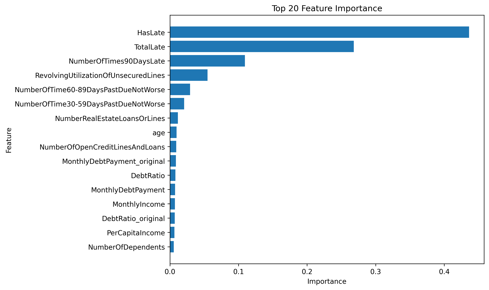

# Kaggle Give Me Some Credit 信用風險預測專案

本專案是以 Kaggle 經典競賽 **Give Me Some Credit** 為練習主題，使用客戶的財務與信用資料，預測該客戶在未來兩年內是否會發生嚴重逾期。

這份專案不只是單純追求分數，也記錄了我從 Random Forest 到 XGBoost、從單一切分到 5-Fold、從亂試特徵到固定實驗基準的完整學習過程。

---

## 一、專案目標

目標欄位：

```python
SeriousDlqin2yrs
```

評分指標：

```python
ROC-AUC
```

本專案主要練習：

- 資料前處理與缺失值處理
- 特徵工程設計與比較
- Random Forest 與 XGBoost 模型訓練
- 5-Fold 交叉驗證
- Kaggle Public / Private Score 比較
- Feature Importance 分析
- random seed 對結果穩定性的影響

---

## 二、資料集簡介

資料來源：Kaggle **Give Me Some Credit**

| 欄位名稱 | 說明 |
|---|---|
| `SeriousDlqin2yrs` | 是否在兩年內嚴重逾期，目標欄位 |
| `RevolvingUtilizationOfUnsecuredLines` | 無擔保循環信用額度使用率 |
| `age` | 年齡 |
| `DebtRatio` | 負債比率 |
| `MonthlyIncome` | 月收入 |
| `NumberOfDependents` | 家庭扶養人數 |
| `NumberOfTime30-59DaysPastDueNotWorse` | 30-59 天逾期次數 |
| `NumberOfTime60-89DaysPastDueNotWorse` | 60-89 天逾期次數 |
| `NumberOfTimes90DaysLate` | 90 天以上逾期次數 |

---

## 三、專案使用套件

| 套件 | 版本 | 用途 |
|---|---:|---|
| `numpy` | 2.3.5 | 建立 OOF 預測與多 Fold 平均預測 |
| `pandas` | 2.2.3 | 讀取資料、整理資料、輸出 submission |
| `scikit-learn` | 1.8.0 | 交叉驗證、缺失值補值、AUC 評估 |
| `xgboost` | 3.1.3 | 建立 XGBoost 分類模型 |
| `matplotlib` | 3.10.8 | 繪製 Feature Importance 圖 |

安裝方式：

```bash
pip install -r requirements.txt
```

`requirements.txt`：

```txt
numpy==2.3.5
pandas==2.2.3
scikit-learn==1.8.0
xgboost==3.1.3
matplotlib==3.10.8
```

---

## 四、專案流程

本專案最後整理成以下流程：

1. 讀取 `cs-training.csv` 與 `cs-test.csv`
2. 保留測試集 `Id`
3. 移除訓練集中 `NumberOfDependents` 為空值的資料列
4. 其他缺失值使用中位數補值
5. 建立逾期相關特徵：`TotalLate`、`HasLate`
6. 對 `RevolvingUtilizationOfUnsecuredLines` 進行 `clip()` 極端值處理
7. 建立收入與負債相關特徵：`MonthlyDebtPayment`、`PerCapitaIncome`
8. 建立缺失值指示特徵：`MonthlyIncome_isna`
9. 對 `DebtRatio` 進行 `clip(upper=50)` 處理
10. 使用 XGBoost 建模
11. 使用 5-Fold 交叉驗證訓練模型
12. 對 Kaggle 測試集進行 5 次預測並取平均
13. 固定使用 `seed=100`
14. 輸出 `submission.csv`
15. 使用 Feature Importance 觀察模型重視的欄位

---

## 五、模型與主要設定

最後主要使用的模型是 **XGBoost**。

```python
from xgboost import XGBClassifier

xgb = XGBClassifier(
    objective="binary:logistic",
    eval_metric="auc",
    n_estimators=800,
    learning_rate=0.03,
    max_depth=4,
    min_child_weight=5,
    subsample=0.8,
    colsample_bytree=0.8,
    gamma=0.1,
    reg_alpha=0.1,
    reg_lambda=1.0,
    random_state=100,
    n_jobs=-1
)
```

採用 XGBoost 的原因：

- 比 Random Forest 更適合這類表格型資料
- 訓練速度與分數表現較穩定
- 可搭配 Feature Importance 觀察特徵影響
- 在 Kaggle 結構化資料競賽中常有不錯表現

---

## 六、特徵工程

最後保留的特徵工程如下：

| 特徵 | 建立方式 | 目的 |
|---|---|---|
| `TotalLate` | 將 30-59、60-89、90 天以上逾期次數加總 | 整合整體逾期程度 |
| `HasLate` | 判斷 `TotalLate > 0` | 標記是否曾經逾期 |
| `RevolvingUtilizationOfUnsecuredLines` clip | 限制極端值上限 | 降低極端值干擾 |
| `MonthlyDebtPayment` | `DebtRatio * MonthlyIncome` | 估算每月負債壓力 |
| `PerCapitaIncome` | `MonthlyIncome / (NumberOfDependents + 1)` | 估算家庭平均收入壓力 |
| `MonthlyIncome_isna` | 判斷 `MonthlyIncome` 是否缺失 | 保留收入缺失本身的訊號 |
| `DebtRatio` clip | `DebtRatio.clip(upper=50)` | 降低負債比極端值影響 |

---

## 七、實驗紀錄摘要

| 實驗版本 | Private Score | 結論 |
|---|---:|---|
| 原始特徵 + 單一 train/valid split | 0.86814 | 初步有效，但穩定性不足 |
| 原始最佳特徵 + 5-Fold | 0.86833 | 分數提升，預測更穩定 |
| 加入 `MonthlyDebtPayment`、`PerCapitaIncome` | 0.86834 | 小幅提升 |
| 加入 `MonthlyIncome_isna` | 0.86837 | 小幅提升 |
| `DebtRatio` clip upper=50 | 0.86843 | 表現最佳的 DebtRatio 處理方式 |
| 5-Fold + seed ensemble | 0.86845 | 更穩定，但不是最高分 |
| 5-Fold + seed=100 | **0.86854** | 目前最佳版本 |
| 5-Fold + seed=100 + `MaxLateLevel` | 0.86821 | 分數下降，不採用 |

目前最佳 Private Score：

```text
0.86854
```

目前最佳版本：

```text
XGBoost + TotalLate + HasLate
+ RevolvingUtilizationOfUnsecuredLines clip
+ MonthlyDebtPayment + PerCapitaIncome
+ MonthlyIncome_isna
+ DebtRatio clip upper=50
+ 5-Fold
+ seed=100
```

---

## 八、我的心路歷程

一開始我只是想先把 Kaggle 流程跑完，所以先用 Random Forest 建立 baseline。當時的重點不是追求高分，而是先理解資料讀取、缺失值處理、模型訓練、產生 submission 這整個流程。

後來我花了不少時間調 Random Forest 的參數，但發現訓練時間很長，而且分數提升不明顯，甚至有時候調參後分數還下降。這讓我學到一件事：機器學習不是模型越大、參數越多就一定越好。

接著我改用 XGBoost，模型表現開始變得比較穩定。這時候我才慢慢理解，表格型資料的提升通常不只是靠調參，而是要搭配資料處理、特徵工程與驗證方式一起看。

在特徵工程的過程中，我嘗試過很多欄位，例如逾期總次數、是否曾經逾期、收入負債特徵、缺失值指示欄位、極端值切片等。有些特徵讓分數上升，有些特徵反而讓分數下降。這讓我理解到：特徵工程不能一次加太多，必須一個一個測試，才知道到底是哪個特徵有幫助。

後來我加入 5-Fold 交叉驗證，發現模型分數比單一切分更穩定。接著又測試不同 Fold 數量與 random seed，最後發現 `seed=100` 在目前版本中表現最好，因此把它固定成後續實驗基準。

這次專案最大的收穫是，我不再只把機器學習看成「換模型、調參數」而已，而是開始理解整個流程：資料處理、特徵設計、模型選擇、驗證方式、分數比較，每一步都會影響最後結果。

---

## 九、結果證明

### Kaggle 分數截圖

```text
images/kaggle_score.png
```


### Feature Importance 圖

```text
images/feature_importance_seed_100.png
```



Feature Importance 用來觀察 XGBoost 在訓練後比較重視哪些欄位，也可以輔助檢查新增的特徵工程是否真的有被模型使用。

---

## 十、專案結構

```text
give-me-credit-practice/
│
├── README.md
├── requirements.txt
├── give_me_credit_xgboost.ipynb
├── cs-training.csv
├── cs-test.csv
├── submission.csv
│
└── images/
    ├── kaggle_score.png
    └── feature_importance_seed_100.png
```

---

## 十一、後續可以繼續嘗試

目前專案先固定在：

```text
XGBoost + 5-Fold + seed=100
```

之後可以繼續嘗試：

1. 使用 LightGBM 或 CatBoost 比較表現
2. 比較更多 `clip()` 上限
3. 針對逾期欄位做更保守的特徵工程
4. 比較單一 XGBoost 與多模型 ensemble
5. 固定目前最佳版本後，再逐步測試新特徵

---

## 十二、專案狀態

目前本專案已整理成一個完整的 Kaggle 機器學習練習專案。

最終保留的版本是目前分數最高且流程相對穩定的版本：

```text
XGBoost + 5-Fold + seed=100
```

這次練習讓我理解到，模型分數的提升不是只靠單純調整參數，而是需要從資料處理、特徵設計、驗證方式與模型穩定性一起思考。
